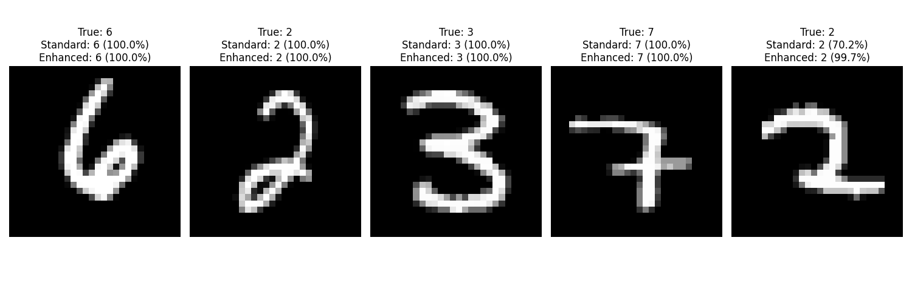

# MNIST Classification Neural Network Deployment

This project demonstrates the deployment of a classification neural network for handwritten digit recognition on various platforms, including Cerebrium's serverless GPU platform.

## Project Overview

- Trained a CNN model on the MNIST dataset achieving 99.04% accuracy
- Implemented preprocessing techniques that improve confidence on real-world inputs
- Deployed the model via multiple methods:
  - Flask REST API for local deployment
  - Gradio web interface for interactive testing
  - Cerebrium serverless platform for cloud deployment

## Repository Structure

- `config.py`: Configuration parameters
- `load_mnist_local.py`: Code to load the MNIST dataset
- `train_model.py`: Script to train the classification model
- `utils.py`: Utility functions
- `test_model_confidence.py`: Script to test model confidence with different preprocessing
- `flask_deploy.py`: Flask API for model deployment
- `gradio_interface.py`: Interactive web interface using Gradio
- `cerebrium_deploy/`: Files for Cerebrium serverless deployment

## Setup and Installation

1. Clone this repository
2. Install dependencies:
   ```
   pip install -r requirements.txt
   ```
3. Run the desired deployment method:
   - Flask API: `python flask_deploy.py`
   - Gradio interface: `python gradio_interface.py`
   - Cerebrium deployment: See instructions in `FINAL_STEPS.md`

## Model Performance

The MNIST classifier achieves:
- **Accuracy**: 99.04% on the test set
- **Confidence**: Near 100% on most test examples
- **Enhanced Preprocessing**: Improves confidence on edge cases



## Deployment Results

### Gradio Interface
The Gradio interface provides an interactive way to test the model with hand-drawn or uploaded digits.

### Flask API
The Flask API provides a REST endpoint for making predictions, accessible at http://127.0.0.1:5000/predict

### Cerebrium Deployment
The model was deployed to Cerebrium's serverless platform, allowing for scalable, cloud-based inference.

## Challenges and Solutions

- **Version Compatibility**: Resolved TensorFlow version incompatibilities between local environment and Cerebrium by defining the model architecture directly in the deployment code
- **Preprocessing Optimization**: Improved prediction confidence by implementing enhanced preprocessing techniques, including thresholding and centering

## Future Improvements

- Implement additional data augmentation for improved robustness
- Explore model optimization techniques like quantization
- Implement CI/CD pipeline for automated deployment

## Author

[Your Name]

## Acknowledgments

- MTailor for providing this assessment challenge
- Cerebrium for their serverless ML platform
